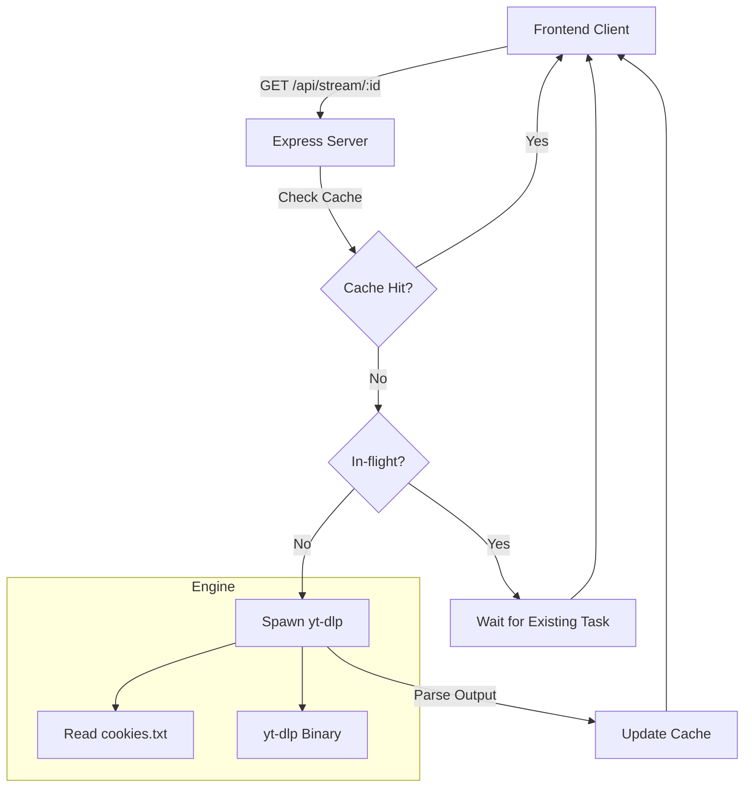

# Sonus Backend - AI Context

This document provides architectural context and development guidelines for the Sonus Backend server to assist AI agents in understanding and contributing to the codebase.

## Project Overview
Sonus-Backend is a lightweight Node.js Express server that acts as a middleware for YouTube data extraction. It leverages the powerful `yt-dlp` command-line utility to perform searches, retrieve video metadata, and extract direct audio stream URLs.

- **Primary Goal**: Provide a fast, reliable API for a music/media frontend to stream YouTube audio.
- **Target Platform**: Render (or any Linux/Windows environment with Node.js).
- **Core Engine**: `yt-dlp` (automatically downloaded during build).

---

## Technical Stack
- **Framework**: [Express.js](https://expressjs.com/)
- **Utility**: [yt-dlp](https://github.com/yt-dlp/yt-dlp)
- **Networking**: [Axios](https://axios-http.com/)
- **Process Management**: Native `child_process.spawn` for yt-dlp execution.

---

## Architectural Insights

### 1. Request Flow
All API requests follow a similar pattern:
1. Receive Express request.
2. Construct `yt-dlp` arguments.
3. Spawn `yt-dlp` process.
4. Parse STDOUT/STDERR.
5. Return JSON response.

### 2. Stream URL Extraction & Optimization
The `/api/stream/:videoId` endpoint is the most critical. It implements:
- **In-memory Caching**: Audio URLs are cached for 4 hours (`CACHE_TTL_MS`) to avoid redundant `yt-dlp` calls.
- **Request Deduplication**: Uses an `inflight` Map to prevent multiple concurrent `yt-dlp` processes for the same `videoId`.
- **Periodic Cleanup**: A background interval clears expired cache entries every 30 minutes.

### 3. Authentication & Cookies
To bypass YouTube's bot detection and access restricted content, the server looks for a `cookies.txt` file in the root directory.
- Path can be overridden via `COOKIES_FILE_PATH`.
- If missing, it falls back to unauthenticated requests.

---

## API Reference

### `GET /api/search`
- **Query**: `q` (required), `limit` (default 20, max 50).
- **Function**: Performs a flat search on YouTube.
- **Output**: Array of video objects (id, title, channel, duration, thumbnailUrl, viewCount).

### `GET /api/info/:videoId`
- **Params**: `videoId` (11-char YouTube ID).
- **Function**: Fetches detailed metadata for a specific video.

### `GET /api/stream/:videoId`
- **Params**: `videoId`.
- **Function**: Returns a direct, time-limited audio URL (`bestaudio`).
- **Optimization**: Cached and deduplicated.

---

## File Structure
- [index.js](file:///c:/Users/victus/Documents/My%20Codes/Sonus-Backend/index.js): Main entry point containing all routes and logic.
- [package.json](file:///c:/Users/victus/Documents/My%20Codes/Sonus-Backend/package.json): Dependencies and build scripts.
- [scripts/download-ytdlp.js](file:///c:/Users/victus/Documents/My%20Codes/Sonus-Backend/scripts/download-ytdlp.js): Build-time script to fetch the latest `yt-dlp` binary.
- `cookies.txt`: (Optional) Netscape format cookies for authentication.
- `yt-dlp.exe` / `yt-dlp`: The binary used for extraction.

---

## Development Guidelines
- **yt-dlp arguments**: Always use `--print` or `--get-url` to minimize process overhead. Avoid downloading full files.
- **Error Handling**: Standardize errors in JSON format: `{ error: string, details: string }`.
- **Platform Compatibility**: Use `path.join` and `os.platform()` checks (already implemented in `index.js` and `download-ytdlp.js`).
- **Render Deployment**: Ensure `ALLOWED_ORIGINS` is set in production to secure the API.

---

## System Architecture

